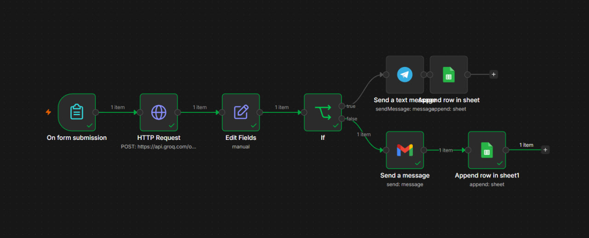
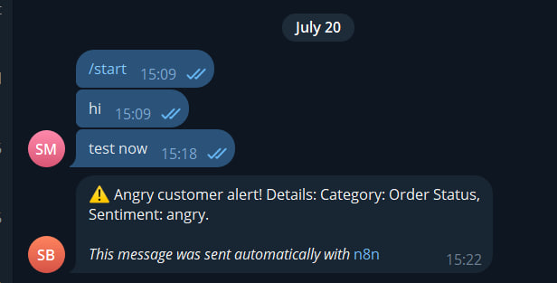
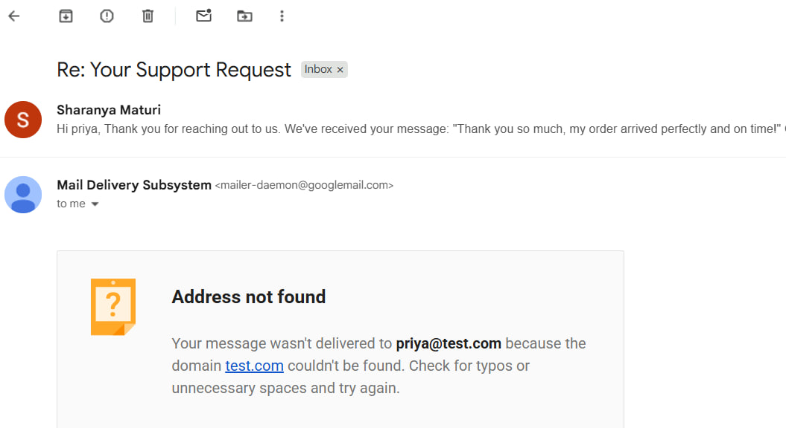
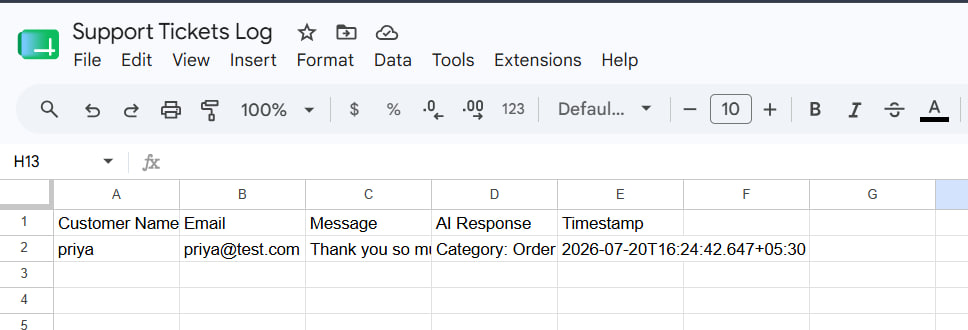

# AI-Powered Customer Support Automation (n8n + Groq LLM)

An agentic AI workflow that automatically classifies, responds to, and escalates 
customer support tickets using LLM-based reasoning — built with n8n workflow automation.

## 🔧 Architecture

## 🛠️ Tech Stack
- **n8n** — workflow orchestration engine
- **Groq API (Llama 3.3 70B)** — AI classification of category & sentiment
- **Telegram Bot API** — real-time escalation alerts for angry customers
- **Gmail API** — automated reply emails for resolved queries
- **Google Sheets API** — ticket logging and tracking

## 🔁 How It Works
1. Customer submits a support ticket via a web form
2. The message is sent to Groq's LLM, which classifies it into a category 
   (Billing, Technical, Order Status, General) and detects sentiment (angry, neutral, happy)
3. **If angry** → an instant alert is sent to the support team via Telegram
4. **If calm** → an automated, context-aware reply is sent to the customer via Gmail
5. Every ticket (regardless of path) is logged to a Google Sheet for tracking

## 📸 Screenshots
| Telegram Alert | Gmail Auto-Reply | Sheet Logging |
|---|---|---|
|  |  |  |

## 🚀 Setup
1. Import `workflow.json` into your n8n instance
2. Add your own API credentials for Groq, Telegram, Gmail, and Google Sheets
3. Activate the workflow and start submitting tickets via the generated form URL

## 💡 Key Learnings
- Designing conditional multi-branch automation logic
- Prompt engineering for reliable structured AI outputs
- Integrating multiple third-party APIs into a single orchestrated pipeline
